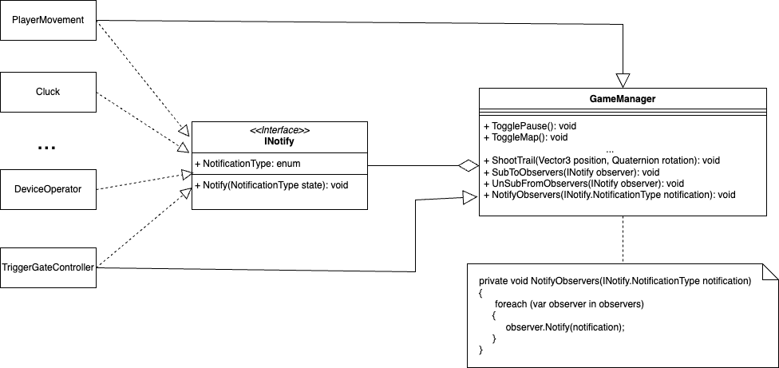

# Game Manager

The game manager uses the observer design pattern. The goal of the game manager and 
other managers is to ensure there is a single point of communication between classes 
to reduce dependencies

