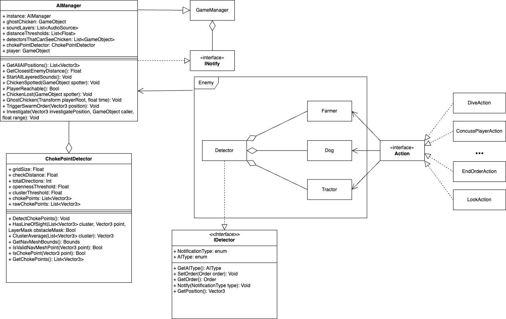

# AI
The AI system mainly consists of 3 behaviour trees (`Farmer`, 
`Dog` and `Tractor`), these utilize actions to create their Behaviours. They 
also link to a `Detector` which is used for applying the constraints used to 
find the chicken. All enemy objects are listed in the `AIManager` which controls the 
overall strategy of all the AIs through its logic and that of `ChokePointDetector`. 
As the `AIManager` triggers events they are notified to the `GameManger`, also events 
of the `GameManager` are used to alter certain behaviours of this script.

