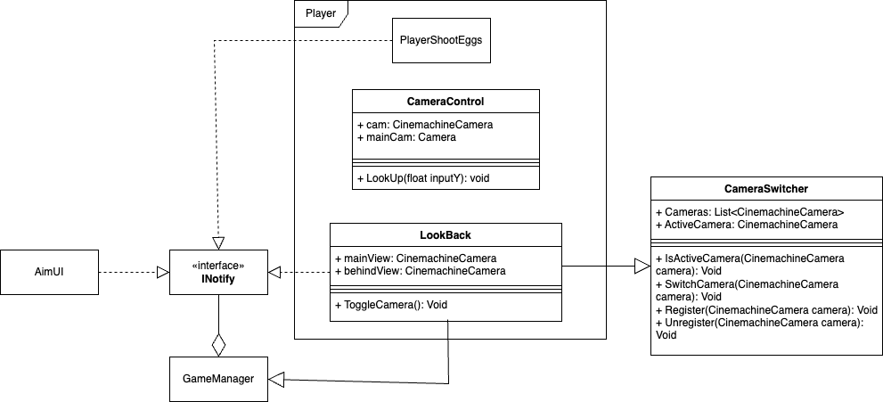

# Cameras
The cameras rely on the `CameraSwitcher` script, this is a script which holds all the 
Cinemachine cameras and is in charge of switching them out for the different views, i.e. looking behind 
and the regular camera. `LookBack` is a script that takes advantage of this and notifies the `GameManager`
on what it does, in turn triggering the `AimUI` and the `PlayerShootEggs`. There is another script which 
manipulates the cameras called `CameraControl`, this is in charge of looking up, it will lower the position of 
the chicken on the screen so you can see more above you.

