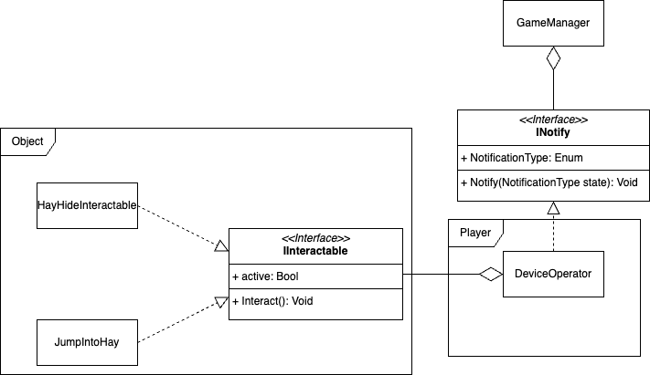

# Interactables
Interactables work by a script on the player which raycasts a certain distance in front of the 
player and checks for obstacles which contain IInteractable every time the interact button is 
pressed. If such an object is present it will go and trigger the interaction.

