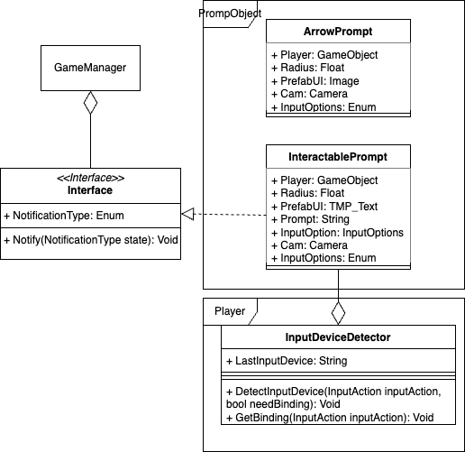

# Prompts
Within the game there are prompts, these are text boxes that are displayed above 
some [interactables](./interactables.md) when you come into range. They work 
by taking the world coordinates of the prompt object and translating it into 2D coordinates 
for the HUD, at which point it will instantiate a text prefab on these coordinates.

